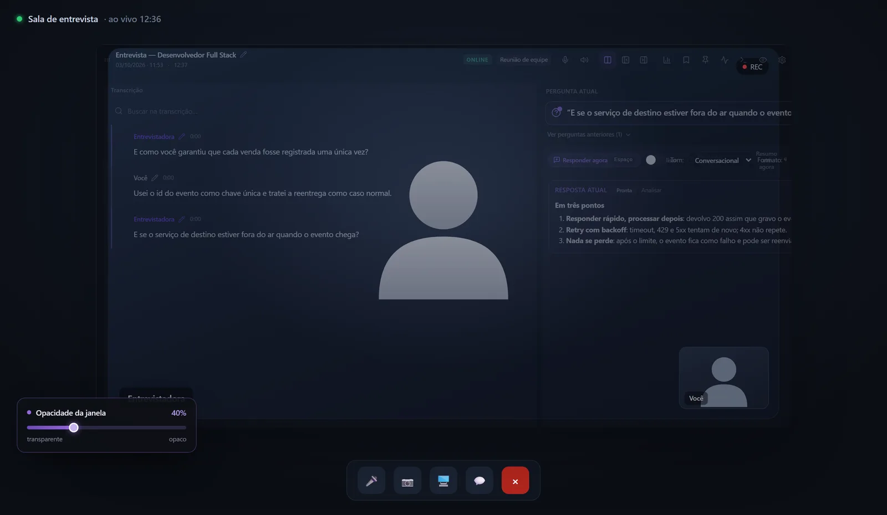
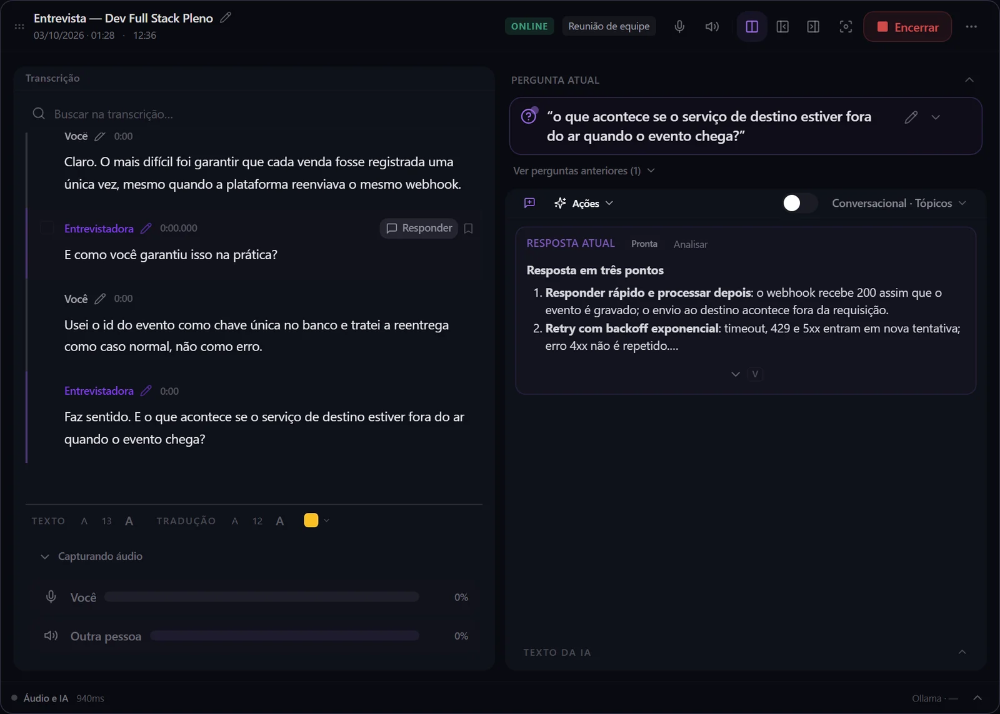
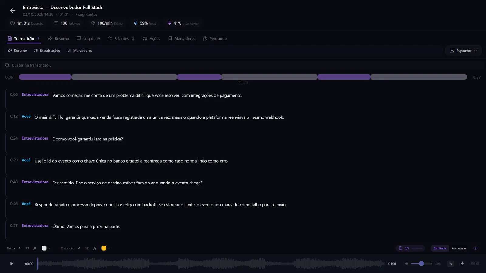
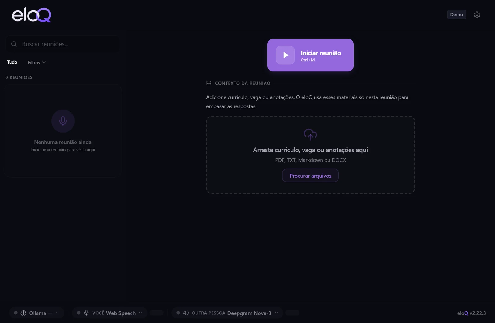
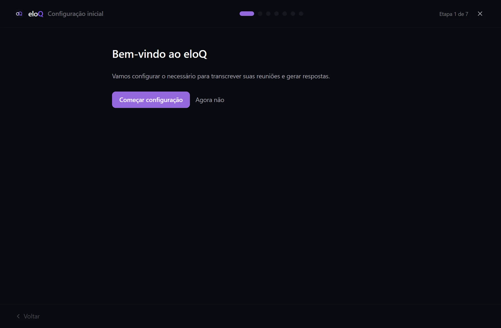

<div align="center">

<picture>
  <source media="(prefers-color-scheme: dark)" srcset="docs/images/eloq-wordmark-dark.png">
  
</picture>

### Seu copiloto em tempo real para entrevistas e reuniões

O eloQ escuta a conversa, escreve o que foi dito, percebe a pergunta e sugere uma resposta numa janela transparente, bem onde você já está olhando.

[](https://github.com/trichains/eloq-releases/releases/latest)
[](https://github.com/trichains/eloq-releases/releases)


[English](README.en.md) · **Português (Brasil)**

<br>

[**⬇ Baixar o eloQ**](https://github.com/trichains/eloq-releases/releases/latest) &nbsp;·&nbsp; [Página do produto](https://trichains.dev/eloq) &nbsp;·&nbsp; [Mapa mental explicativo](https://trichains.dev/eloq/mapa-mental.html)

<br>



<sub>A chamada ao fundo é uma ilustração. A janela do eloQ é real.</sub>

</div>

---

## O que é o eloQ?

Você está numa entrevista, numa call de vendas ou numa reunião importante. Alguém pergunta algo para o qual você não estava preparado. O eloQ é o ajudante ao seu lado: ele ouve a pergunta, confere o que já foi dito (e os documentos que você deu) e **sugere uma resposta numa janelinha por cima de tudo**. Você bate o olho, mantém o contato visual e responde com as suas palavras.

É um aplicativo de desktop para **Windows** e **macOS**, com a interface em **português do Brasil e em inglês**.

## Destaques

| | |
|---|---|
| 🎙️ **Ouve os dois lados** | O microfone vira **VOCÊ** e o áudio do sistema vira **OUTRA PESSOA**, transcritos separadamente, cada um com o provedor que você preferir. |
| 🧠 **Percebe a pergunta** | As perguntas são reconhecidas por regras em português e inglês, sem IA: previsível, instantâneo e sem gastar chamada de API. |
| ✍️ **Sugere, não inventa** | Antes de chamar o modelo, o eloQ confere a pergunta com a conversa e com os seus documentos. Se ela citar algo que ninguém estabeleceu, ele fica em silêncio em vez de inventar. O painel **Contexto usado** mostra de onde cada resposta saiu. |
| 🪟 **Transparente e sempre no topo** | Uma janela sem borda, com opacidade de 15% a 100%: mais opaca para ler com conforto, mais transparente para manter o contato visual. |
| ⌨️ **Quem manda é você** | A pergunta aparece e você aperta **ESPAÇO** (ou **Responder agora**) para receber a sugestão. Prefere deixar no automático? Dá pra ligar a resposta automática nas configurações. |
| 🎧 **Grava e você revê** | Grave a reunião e ouça depois, com forma de onda, velocidade de reprodução e a transcrição sincronizada ao áudio. |
| 🌍 **Tradução ao vivo** | Traduza a transcrição e as respostas durante a reunião, com escolha entre vários provedores de tradução. |
| 📌 **Itens de ação e marcadores** | O app extrai tarefas da conversa, deixa fixar momentos importantes e separa a reunião em tópicos para revisar rápido. |
| 📄 **Documentos por reunião** | Currículo, vaga e anotações entram como contexto só daquela reunião, isolados das demais. |

## Telas

<table>
  <tr>
    <td width="50%"></td>
    <td width="50%"></td>
  </tr>
  <tr>
    <td align="center"><b>Entrevista ao vivo</b><br><sub>Os dois lados transcritos, a pergunta detectada e a resposta sugerida ao lado.</sub></td>
    <td align="center"><b>Gravação e reprodução</b><br><sub>Forma de onda, controle de velocidade e a transcrição sincronizada ao áudio.</sub></td>
  </tr>
  <tr>
    <td></td>
    <td></td>
  </tr>
  <tr>
    <td align="center"><b>Início</b><br><sub>Contexto da reunião (currículo, vaga, anotações) e os provedores ativos para cada canal.</sub></td>
    <td align="center"><b>Configuração inicial</b><br><sub>Um assistente em sete etapas, para sair com transcrição e respostas funcionando.</sub></td>
  </tr>
</table>

<sub>A conversa de entrevista das telas é um exemplo fictício.</sub>

## Baixar

Pegue o instalador do seu sistema na **[última versão](https://github.com/trichains/eloq-releases/releases/latest)**:

| Sistema | Arquivo para baixar | Requisitos |
|---|---|---|
| **Windows** | `eloQ_<versão>_x64-setup.exe` | Windows 10 ou 11, 64 bits |
| **macOS** | `eloQ_<versão>_aarch64.pkg` | macOS 13 ou superior, **Apple Silicon** (M1 ou mais novo) |

> No momento não há versão para Linux nem para Mac Intel.

Os outros arquivos de cada versão (`latest.json`, `.nsis.zip` e `.sig`) são usados pelo **atualizador automático** no Windows. Você não precisa baixá-los.

### Instalar no Windows

1. Execute o `eloQ_<versão>_x64-setup.exe`. Ele instala só para o seu usuário, sem precisar de administrador.
2. Se o Windows SmartScreen mostrar um aviso, clique em **Mais informações** e depois em **Executar assim mesmo**.
3. Abra o eloQ. As versões novas são baixadas e instaladas sozinhas, e toda atualização é assinada criptograficamente.

### Instalar no macOS

1. Abra o `eloQ_<versão>_aarch64.pkg` e siga o Instalador.
2. Na primeira abertura, o Mac pode avisar que o app é de um **desenvolvedor não identificado**, porque o eloQ ainda não tem a assinatura da Apple. Vá em **Ajustes do Sistema → Privacidade e Segurança** e clique em **Abrir Mesmo Assim**. É só uma vez, e você não precisa desligar nenhuma proteção do sistema.
3. Abra o **eloQ** na pasta **Aplicativos**. Quando pedir, permita o acesso ao **microfone** e à **gravação de tela e áudio do sistema**, para o eloQ ouvir os dois lados da chamada.
4. Reinstalar ou atualizar troca o app, mas mantém os seus dados e as chaves salvas.

> A atualização automática no Mac ainda não chegou. Quando sair uma versão nova, baixe o novo `.pkg` e instale por cima da antiga.

## Primeiros passos

1. **Rode o assistente de configuração.** Um guia em sete etapas que deixa a transcrição e as respostas funcionando já na primeira abertura.
2. **Escolha os provedores.** Um para transcrever e outro para responder, local ou na nuvem. Cole a sua própria chave de API onde for preciso. As chaves ficam no Gerenciador de Credenciais do Windows ou no Keychain do macOS.
3. **Adicione contexto (opcional).** Coloque o currículo, a vaga ou anotações daquela reunião.
4. **Comece a reunião** e deixe a sua chamada de vídeo aberta como de costume. O eloQ escuta os dois lados.
5. **Aperte ESPAÇO** quando surgir uma pergunta e bata o olho na sugestão. Se preferir o botão, use **Responder agora**.

## Do áudio à resposta na tela

```
 microfone ──────┐                                  ┌─ trava: a pergunta tem base
                 ├─▶ transcrição ─▶ turnos e ─▶     │   na conversa?
 áudio do sistema┘   por canal      perguntas       └─▶ modelo (com fila e plano B) ─▶ resposta na tela
```

1. **Captura em dois canais.** Microfone como VOCÊ, áudio do sistema como OUTRA PESSOA (WASAPI loopback no Windows, ScreenCaptureKit no macOS).
2. **Transcrição por canal.** Cada canal pode usar um provedor diferente, local ou de nuvem.
3. **Turnos e detecção de pergunta.** As falas são agrupadas em turnos e a pergunta é reconhecida por regras, sem chamar IA.
4. **Contexto com trava.** O prompt é montado com a transcrição e os seus documentos. Se a pergunta depender de algo que nunca foi dito, o modelo não é chamado.
5. **Modelo com fila e plano B.** O **Responder agora** passa na frente das respostas automáticas. Se um provedor falha ou bate no limite, o pedido segue para o próximo, com um aviso honesto na tela.
6. **Overlay e janela Foco.** A resposta chega em streaming e pode ser encurtada, adaptada ou traduzida.

## Funciona com os provedores que você escolher

| | Local (no seu computador) | Nuvem (com a sua chave) |
|---|---|---|
| **Transcrição** | Whisper.cpp, Sherpa-ONNX, ONNX Runtime, Parakeet | Deepgram, Groq Whisper, Azure Speech, Whisper API da OpenAI |
| **Respostas (LLM)** | Ollama, LM Studio | OpenAI, Anthropic, Gemini, Groq, OpenRouter |
| **Tradução** | OPUS-MT (funciona sem internet) | Microsoft, Google, DeepL ou um modelo de IA |

## Privacidade: você escolhe

O eloQ **não tem servidor próprio para áudio ou texto** e usa **as suas chaves de API**. Você decide, canal por canal, se quer tudo no seu computador ou a qualidade de um serviço de nuvem.

| Se você escolher... | O que acontece |
|---|---|
| **Tudo local** (Whisper.cpp, Sherpa-ONNX, Parakeet, Ollama, LM Studio, OPUS-MT) | Áudio e texto **nunca saem do seu computador**. |
| **Transcrição em nuvem** (Deepgram, Groq, Azure, OpenAI) | O áudio é enviado ao provedor para ser transcrito. |
| **Respostas em nuvem** (OpenAI, Anthropic, Gemini, Groq, OpenRouter) | A conversa e os documentos daquela pergunta são enviados ao provedor para gerar a resposta. |
| **Chaves, histórico e gravações** | Ficam só na sua máquina (Gerenciador de Credenciais ou Keychain, e um banco local). |
| **Licença** | Só o seu e-mail e um identificador da instalação em hash vão ao servidor de licença. **Áudio, transcrição e prompts nunca vão.** |

Ao usar um provedor de nuvem, valem a política de privacidade e as configurações de retenção da **sua conta** nele. Vale conferir antes de uma conversa sensível. Quer o máximo de privacidade? Combine transcrição e respostas locais.

## Demo e versão completa

- **Demo (gratuita).** Baixe, instale e teste o eloQ numa conversa de verdade. Ela tem limites de tempo de reunião e de respostas, e alguns recursos (como gravação, exportação e provedores de nuvem) ficam na versão completa.
- **Versão completa.** Liberada por licença. Você ativa com um código enviado por e-mail, e cada licença vale para um número limitado de dispositivos (um PC com Windows e um Mac podem dividir a mesma).

Dúvidas, ou interesse em usar o eloQ com o seu time? **[Fale comigo](https://trichains.dev/contact)**.

## Limites conhecidos

- O **macOS** ainda não tem a assinatura da Apple nem atualização automática.
- Uma **pergunta de sim ou não** sem palavra interrogativa e sem "?" não dispara resposta automática. Aperte **ESPAÇO** e o eloQ responde do mesmo jeito.
- Sem versão para **Linux** nem para **Mac Intel**.
- O código-fonte é **privado**. Só os instaladores são públicos.

## Use com responsabilidade

O eloQ é um apoio ao seu raciocínio, não um substituto para você. Antes de usar, confira as regras da sua entrevista, escola ou empresa e as leis sobre gravação de conversas onde você mora. Avise as pessoas envolvidas quando a gravação exigir isso.

## Perguntas frequentes

<details>
<summary><b>O eloQ é gratuito?</b></summary>

Você pode baixar e usar a Demo de graça. A versão completa é liberada por licença. Para detalhes, veja a [página do produto](https://trichains.dev/eloq) ou [fale comigo](https://trichains.dev/contact).
</details>

<details>
<summary><b>Ele responde sozinho?</b></summary>

Por padrão, não: você aperta **ESPAÇO** (ou **Responder agora**) quando quiser uma sugestão. Existe uma opção nas configurações para ligar a resposta automática, e mesmo assim o eloQ responde no máximo uma vez por pergunta.
</details>

<details>
<summary><b>A outra pessoa consegue ver a janela do eloQ?</b></summary>

No Windows, o modo stealth exclui a janela de prints, gravações e compartilhamento de tela. Isso depende do sistema e do aplicativo de compartilhamento, então teste antes de uma chamada importante. Siga as regras do contexto em que você usar o eloQ.
</details>

<details>
<summary><b>O meu áudio vai para os servidores do eloQ?</b></summary>

Não. O eloQ não tem servidor próprio para áudio ou texto. Se você usar provedores locais, nada sai do seu computador. Se escolher um provedor de nuvem para transcrever ou responder, o conteúdo vai para esse provedor, e valem as regras da sua conta nele. Veja [Privacidade](#privacidade-você-escolhe).
</details>

<details>
<summary><b>O código é aberto?</b></summary>

Não. O código-fonte é privado e este repositório contém apenas os instaladores e os metadados de release.
</details>

<details>
<summary><b>Como atualizo?</b></summary>

No Windows, as atualizações são baixadas e instaladas automaticamente. No macOS, baixe o `.pkg` mais recente na [página de releases](https://github.com/trichains/eloq-releases/releases/latest) e instale por cima do antigo.
</details>

## Reportar um problema

Achou um bug ou tem uma sugestão? [Abra uma issue](https://github.com/trichains/eloq-releases/issues) com o seu sistema (Windows ou macOS e a versão), a versão do eloQ e o que aconteceu. **Não cole chaves de API, áudio nem conversas privadas.**

## Sobre este repositório

Este repositório guarda apenas os **instaladores oficiais do eloQ** e os metadados de release usados pelo atualizador automático. O código-fonte do aplicativo é mantido de forma privada, então não aceitamos pull requests com código aqui.

<br>

<div align="center">

<sub>Feito por <a href="https://trichains.dev">Cristhian Almeida</a>. Nomes e marcas de provedores citados pertencem aos respectivos donos e não indicam parceria.</sub>

</div>
